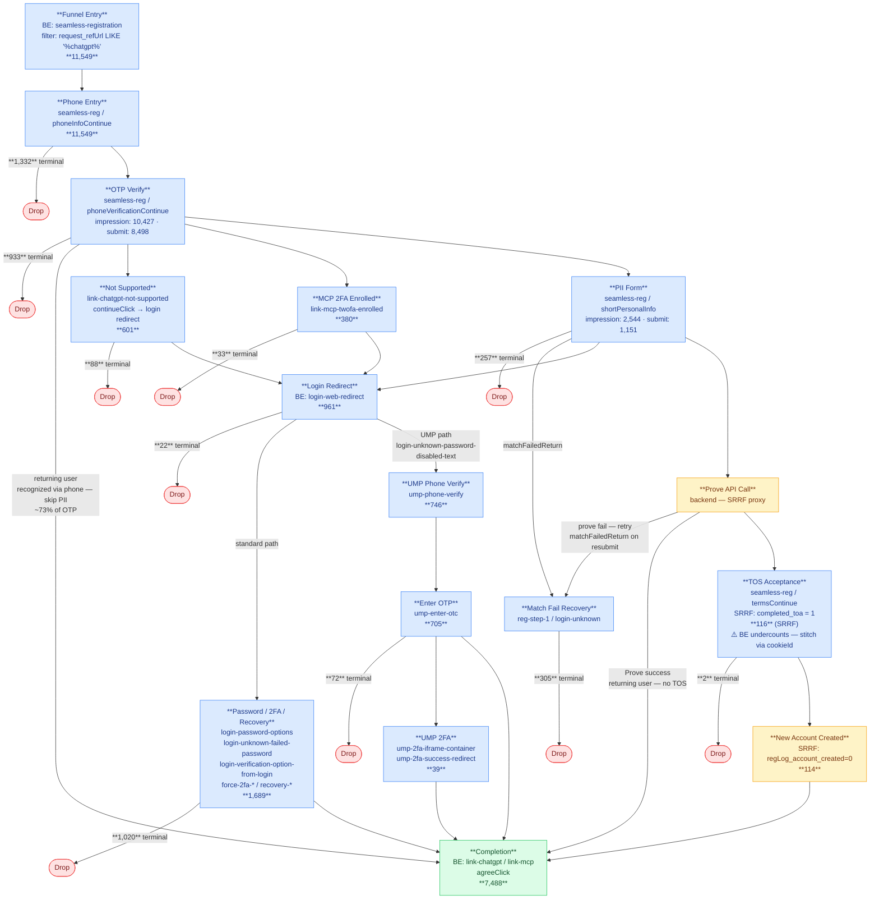

# ChatGPT Authentication Funnel

Users arriving at CK content embedded in ChatGPT start unauthenticated. They must complete a registration or login flow to see their personalized data.

## Completion Anchor

**Primary (recommended):** BigEvent `content_screen IN ('link-chatgpt', 'link-mcp')`, `system_eventType = 2`, `system_eventCode = 'agreeClick'`

**Secondary (unreliable):** `service_bus_streaming_etl.usermanagement_opt_in_etl` where `data.consentInfo.product = 'ChatGPTConsent'` and `data.consentInfo.consentAction = 'Consented'`. Caveat: this table has irregular volume patterns (zero-volume days followed by spikes), suggesting batch writes rather than real-time tracking. Timestamp may reflect write time, not event time. Use BigEvent as the anchor instead.

## Entry Point

`seamless-registration` with `request_refUrl LIKE '%creditkarma.com/signup/chatgpt%'` — validated as the consistent first screen across all user types.

## Session Stitching (Cross-Auth)

Users start unauthenticated — early funnel events have NULL `user_dwNumericId`. No single ID reliably stitches the full session; use IDs in combination:

**Session stitching definition:**
1. **Within a single auth state:** use `user_traceId` (0 collisions — perfectly 1:1 to numericId)
2. **Across auth boundary or page reloads:** use `user_cookieId`, but only where `cookieId` maps to exactly 1 `numericId`. Exclude the 0.1% of cookieIds with 2+ numericIds (shared device / browser reset) or apply timestamp disambiguation.
3. **Recommended query pattern:** find completers via `agreeClick` → get their `cookieId` → filter to cookieIds with `COUNT(DISTINCT numericId) = 1` → pull all events on that cookieId within the session window

**ID coverage on funnel entry events** (validated Mar 10):
| ID | Coverage | Notes |
|---|---|---|
| `user_traceId` | 100% | **Cleanest 1:1 key** — 0 of 1,722 traces map to multiple numericIds. Reliable within a single auth state; changes at page reloads and at authentication. |
| `user_cookieId` | 100% | Persists across traceId changes and auth boundary — use to bridge pre-auth TOS (`termsContinue`) to post-auth `agreeClick`. **Caveat: 2 of 1,720 cookies (0.1%) map to 2 numericIds** (shared device / browser reset). Validate 1:1 before using as stitch for a specific user. Validated: same cookieId across all 4 traceIds in a 6.5-min new-user session. |
| `user_deviceId` | 100% | Cross-checked: same result as cookieId (6 users tested) |
| `user_dwNumericId` | 20% | Auth-only, expected for unauth start |
| `glid` | 2% | Auth-only — do NOT use for this stitch |

## Session Window

User-estimated: 5–10 minutes. Current buffer: 15 minutes from first `seamless-registration` event. Not yet empirically validated — longest observed session in sample was 7.5 minutes (account recovery failure).

## User Types

Four distinct paths through this funnel, determined by recognition at different stages:

1. **Returning — recognized at OTP** — existing CK account with verified phone. After OTP verify, system recognizes them and skips PII entirely → straight to completion (`link-chatgpt`/`link-mcp`). **This is the majority path (~4,900 of ~7,400 completers).**

2. **Returning — recognized at Prove (no TOS)** — PII submitted, Prove API matches to existing account. Skips TOS and login → straight to completion. No intermediate auth screen.

3. **Returning — PII match → login redirect** — PII submitted, matched but requires login. Routed to `login-web-redirect` → password/2FA/recovery screens. Includes UMP sub-path (`ump-phone-verify` → `ump-enter-otc`) for password-disabled accounts.

4. **New users** — no CK account. PII → Prove → TOS acceptance (`termsContinue`) → new account created → completion. TOS fires pre-auth on a different traceId — stitch via cookieId.

## Flowchart

Sources: BE = `sponge_BigEvent`, SRRF = `seamless_registration_raw_funnel`

Drop counts are terminal (mutually exclusive): sum to 4,064 = 11,549 entry − 7,488 completions.

## Validated User Paths (Mar 10–12 + enrichment Mar 17)

### Returning — Recognized at OTP (majority path)
`seamless-registration` (phone → OTP) → `link-chatgpt`/`link-mcp` (agreeClick)
No PII step. System recognizes the phone number and skips straight to consent. ~4,900 of ~7,400 completers.

### Returning — Prove Success (no TOS)
`seamless-registration` (shortPersonalInfo → PII submit) → Prove API matches → `link-chatgpt` (agreeClick)
No login redirect, no auth screens. Backend Prove matches identity and skips TOS. Validated for 2/3 SRRF prove-success returning users.

### Returning — PII Match → Login Redirect
`seamless-registration` (shortPersonalInfo) → `login-web-redirect` → `login-password-options` (submit) → `link-chatgpt` (agreeClick)

### Returning — UMP (password-disabled)
`seamless-registration` → `login-web-redirect` → `login-unknown-password-disabled-text` → `ump-phone-verify` → `ump-enter-otc` → `link-chatgpt` (agreeClick)
UMP is inside login-web-redirect, not a parallel entry branch.

### Returning — Forced 2FA (rare, valid)
`seamless-registration` → `login-web-redirect` → `login-password-options` → `force-2fa-phone-check` → `force-2fa-new-phone` → `force-2fa-verify-email-otc` → `force-2fa-verify-new-phone-otc` → `link-chatgpt` (agreeClick)

### New User — Prove Success → TOS → Account Created
`seamless-registration` (shortPersonalInfo) → Prove API → `termsContinue` (pre-auth, diff traceId) → new account created → `link-chatgpt`/`link-mcp` (agreeClick)
Stitch via cookieId across auth boundary.

### MCP 2FA Enrolled
`seamless-registration` → OTP → `link-mcp-twofa-enrolled` (continueClick) → `login-web-redirect` → auth screens → completion

### Identity Match Failure (drops off)
`seamless-registration` (matchFailedReturn) → `reg-step-1` → `login-unknown` → `login-unknown-password-disabled-text` → phone/email OTC attempts → **drop**
Also reachable via Prove fail retry: prove fail → user retries PII → matchFailedReturn → same recovery flow.

### TOS Match Failure (rare — ~16 in 90 days)
`seamless-registration` → Prove → `termsContinue` → termsSubmitError + matchFailedReturn → `reg-step-1` → login flow → **mostly drop**

### Account Recovery Loop (rare, drops off)
`seamless-registration` → `login-web-redirect` → `login-unknown-step-1-dup` → `recovery-newphone-phone` ↔ `recovery-newphone-code` (repeated failures) → `login-acct-look-up` → `login-verification-option` → **drop** or loop back to start

## Known Screen Names (BigEvent `content_screen`)

| Screen | What it is | Path |
|---|---|---|
| `seamless-registration` | Multi-step: phone entry, OTP, shortPersonalInfo, DOB, terms | All (entry point) |
| `link-chatgpt` | "Allow CK to connect to ChatGPT" — Agree/Cancel | All (completion) |
| `link-mcp` | Second completion screen (same agreeClick consent) | All (completion) |
| `link-mcp-twofa-enrolled` | 2FA enrollment screen — has continueClick/cancelClick | OTP → Login Redirect path |
| `link-chatgpt-not-supported` | Ineligibility gate — continueClick routes to login redirect | OTP → Login Redirect (4% of entry cohort) |
| `ump-2fa-iframe-container` | UMP 2FA iframe for phone verification | UMP path |
| `ump-2fa-success-redirect` | UMP 2FA success redirect | UMP path |
| `ump-phone-verify` | Phone number entry for existing users | Returning (verified phone) |
| `ump-enter-otc` | OTP code entry for existing users | Returning (verified phone) |
| `login-web-redirect` | Redirect to login after PII match | Returning (no verified phone) |
| `login-password-options` | Password login | Returning |
| `login` | Login screen | Returning |
| `login-options` | Login method selection | Returning |
| `login-unknown` / `login-unknown-password-disabled-text` | Password-disabled login flow | Returning (recovery) |
| `login-unknown-step-1-dup` | Duplicate of login-unknown step 1 | Returning (recovery) |
| `login-verification-option` | Choose verification method (email/phone) | Returning (recovery) |
| `login-otc-entry-phone` / `login-otc-entry-email` | OTC entry by method | Returning (recovery) |
| `login-enter-otc-from-email` | Email OTC entry | Returning (recovery) |
| `login-acct-look-up` | Account lookup | Returning (recovery) |
| `reset-login-flow` | Reset login state | Returning (recovery) |
| `force-2fa-phone-check` / `force-2fa-sending-phone-otc` | Forced 2FA initiation | Returning (high-security) |
| `force-2fa-new-phone` | New phone entry for 2FA | Returning (high-security) |
| `force-2fa-verify-email-otc` / `force-2fa-verify-new-phone-otc` | 2FA verification | Returning (high-security) |
| `recovery-newphone-phone` / `recovery-newphone-code` | Phone recovery flow | Returning (recovery) |
| `reg-step-1` | Traditional registration step 1 (fallback after match failure) | Edge case |
| `report-pull-interstitial` | Credit pull loading screen | Returning |
| `ump-error` | Phone verification error | Edge case |
| `force-2fa-sending-email-otc` | 2FA email OTC variant | Returning (high-security) |
| `force-2fa-verify-phone-otc` | 2FA phone OTC variant | Returning (high-security) |
| `login-enter-otc-from-phone` | Phone OTC entry (login) | Returning (recovery) |
| `login-unknown-failed-password` | Failed password attempt within login flow | Returning (auth) |
| `login-verification-option-from-login` | Verification method chooser from login | Returning (auth) |
| `login-update-password` | Password update screen | Returning (recovery) |
| `login-verify-identity-birthday-ssn` | Identity verify via DOB/SSN | Returning (recovery) |

## Screens Outside Funnel Scope

The following screens appear in the ChatGPT refUrl cohort but are **not part of the auth funnel** — they are return visits or post-completion app screens that occur days to months after the original funnel session:

| Screen | Why excluded |
|---|---|
| `link-anywhere` | Post-completion return visit |
| `login-seamless-ck-brandshake` | Post-completion return visit |
| `login-email-auth-factor` | Post-completion return visit |
| `signup` | Post-completion return visit |

## Key Funnel Timing (from entry point forward)
- 0 sec: `seamless-registration` (phone entry)
- ~5–20 sec: OTP verification
- ~20–85 sec: shortPersonalInfo / PII match (if needed)
- ~48–95 sec: Login redirect + password (returning users)
- ~60–85 sec: 2FA flow (if forced)
- ~80–170 sec: Recovery loops (if account recovery needed)
- Up to 450 sec (7.5 min): Extreme recovery cases before drop-off

## Recent Metrics

Full step counts — use these to calculate any conversion/drop rate without requerying. Append a new snapshot when counts are refreshed.

### Snapshot: Jan 1 – Mar 17, 2026 (pulled 2026-03-17)

| Step | Screen / Event | Count | Unit |
|---|---|---|---|
| Entry | seamless-registration (request_refUrl LIKE '%chatgpt%') | 11,549 | cookies |
| Phone entry impression | seamless-reg / phoneInfoContinue | 11,549 | cookies |
| Phone drop (terminal) | — | 1,332 | cookies |
| OTP verify impression | seamless-reg / phoneVerificationContinue type 1 | 10,427 | cookies |
| OTP submit | seamless-reg / phoneVerificationContinue type 2 | 8,498 | cookies |
| OTP drop (terminal) | — | 933 | cookies |
| Not Supported screen | link-chatgpt-not-supported | 601 | cookies |
| Not Supported drop (terminal) | — | 88 | cookies |
| MCP 2FA Enrolled screen | link-mcp-twofa-enrolled | 380 | cookies |
| MCP 2FA drop (terminal) | — | 33 | cookies |
| PII form impression | seamless-reg / shortPersonalInfo type 1 | 2,544 | cookies |
| PII submit | seamless-reg / shortPersonalInfo type 2 | 1,151 | cookies |
| PII drop (terminal) | — | 257 | cookies |
| Match fail recovery | seamless-reg / matchFailedReturn | — | — |
| Match fail drop (terminal) | — | 305 | cookies |
| Login redirect | login-web-redirect | 961 | cookies |
| Login redirect drop (terminal) | — | 22 | cookies |
| Password / 2FA / Recovery screens | login-password-options + variants | 1,689 | cookies |
| Auth drop (terminal) | — | 1,020 | cookies |
| UMP phone verify | ump-phone-verify | 746 | cookies |
| UMP enter OTP | ump-enter-otc | 705 | cookies |
| UMP drop (terminal) | — | 72 | cookies |
| UMP 2FA | ump-2fa-iframe-container | 39 | cookies |
| TOS impression | seamless-reg / termsContinue (SRRF) | 116 | cookies |
| TOS drop (terminal) | — | 2 | cookies |
| New account created | SRRF regLog_account_created=0 | 114 | cookies |
| **Completion** | link-chatgpt / link-mcp + agreeClick | **7,488** | cookies |

## Open Questions
- **✅ RESOLVED — New-user TOS screen** — `termsContinue` DOES fire in BigEvent within `seamless-registration`, but **pre-auth on a different traceId** than the completion event. A new traceId is created at authentication — stitch via `cookieId` to connect pre-auth TOS to post-auth `agreeClick`. Also trackable via SRRF `completed_toa = 1`, validated against `matchedMembers.validationTs` at 94%.
- **✅ RESOLVED — `regLog_account_created` is an inverted flag** — `1` = failure, `0` = success. Validated across all affiliates: `account_created=0` + `completed_toa=1` matches matchedMembers at 92%; `account_created=1` matches at <1%. The 74 OpenAI users with `account_created=1` were account creation failures, not successes. Use `completed_toa=1` AND `regLog_account_created=0` as the new-user completion definition.
- Session window (15 min) not yet empirically validated — max observed: 7.5 min (account recovery). Buffer appears adequate.
- Forced 2FA and recovery paths confirmed across 3 days (2 sessions each) but still low volume
- `regLog_ssn_lookup_success` and `regLog_report_pull_creditfreeze` — suspected inverted flags (same `regLog_` prefix pattern as the confirmed-inverted `regLog_account_created`). Not yet validated against ground truth.

## Tables
| Table | Role |
|---|---|
| `kafka_sponge.sponge_BigEvent` | All funnel screen events (primary) |
| `service_bus_streaming_etl.usermanagement_opt_in_etl` | Consent record (unreliable — batch writes, use BE instead) |
| `dw.seamless_registration_raw_funnel` | New-user registration backend events; `completed_toa` = TOS completion; join on `numericid` |
| `dw.matchedMembers` | Member lifecycle timestamps; `validationTs` = validated completion for new-user path |
