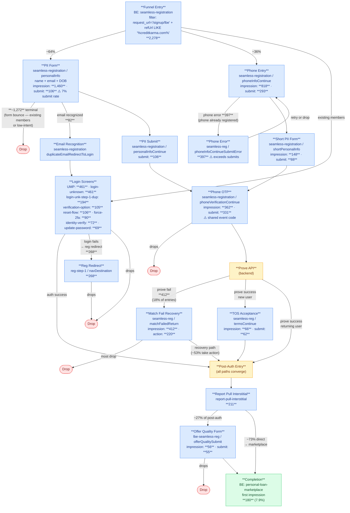

# LBE / CK-Internal-Origin Auth Funnel — Sep 2025

Historical snapshot of the LBE funnel for users originating from within the CK website/product (i.e., `request_refUrl LIKE '%creditkarma.com%'` excluding Intuit params). Compare to `Funnels/lbe-intuit-2025.md` for the Intuit-origin flow in the same period, and `Funnels/lbe-intuit.md` for current state (Mar 2026).

**Key difference from Intuit-origin (Sep 2025):** CK-internal users are already in the CK product and many are existing members — this drives a large login/returning-user path, a very low PII submit rate (7% vs 28% for Intuit), extremely high phone validation errors (phones already registered), and a much higher Prove fail rate (18% of entries vs 6%). Despite this pre-auth friction, conversion (7.9%) is more than double Intuit-origin (3.5%) in the same period — CK-internal users are more purchase-intent and convert efficiently once authenticated.

## Completion Anchor

**Primary:** BigEvent `content_screen = 'personal-loan-marketplace'`, `system_eventType = 1` (first impression). Same anchor as all LBE variants.

## Entry Point

`seamless-registration` with `request_url = '/signup/lbe'` AND `request_refUrl LIKE '%creditkarma.com%'` AND `request_refUrl NOT LIKE '%intuit%'`

3-day volume (Sep 1–3, 2025): **2,278 cookies** (~760/day; Intuit-origin same period was ~161/day)

## Session Stitching

Identical to other LBE variants: stitch via `user_cookieId` across auth boundary. Pre-auth events use `user_traceId` within a single auth state. Extended post-auth window to +3 days (Sep 1–6) for cross-session stitching.

## Session Window

**Post-auth data extended to +3 days** from entry. Same logic as other LBE variants — cookieId changes at account creation, and some users return on later sessions.

## User Types and Paths

### Path A: PII-First (~64% of entries, ~1,460 form loads)

Users see the full PII form but submit at very low rates (~7%). Most likely explanation: many are existing CK members whose email or phone is already registered — they get stuck on validation errors or abandon after seeing the form.

- **Sub-path A1: Email Recognized** — `duplicateEmailRedirectToLogin` fires → login screens → post-auth (82 cookies)
- **Sub-path A2: New User** — PII submit → phone OTP → Prove → TOS → new account created → post-auth (~106 submit)
- **Sub-path A3: Prove Fail** — very high rate (412 total matchFailedReturn across all paths) — Prove identity mismatch likely driven by existing-member data conflicts

### Path B: Phone-First (~36% of entries, ~818 impressions)

Users enter phone number first. **High phone validation error rate**: `phoneInfoContinueSubmitError` = 397 events, which exceeds actual phone submits (293). Suggests many users' phone numbers are already associated with a CK account, triggering duplicate-phone errors. Users who successfully submit phone proceed to short PII → OTP → Prove.

### Path C: Login / Returning Users (large segment)

A major segment of CK-internal users are existing CK members:
- `login-unknown-password-disabled-text` (UMP / OTP-only accounts): 461 cookies
- `login-unknown` / `login-unknown-step-1-dup`: 461/194 cookies
- `login-verification-option`: 105 cookies (verification choice screen)
- `login-update-password`: 69 cookies (forced password reset)
- `reset-login-flow`: 106 cookies
- `login-verify-identity-birthday-ssn`: 72 cookies (identity verification)
- `force-2fa-phone-check` / `force-2fa-sending-phone-otc` / `force-2fa-verify-phone-otc`: 90/76/67 cookies

This path is much larger than in the Intuit-origin funnel, consistent with CK-internal traffic containing a high proportion of existing members.

### Post-Auth (all paths converge)

`report-pull-interstitial` → [`lbe-seamless-reg` offer quality, ~27% of post-auth users] → `personal-loan-marketplace` (completion)

Post-auth is efficient: 180/211 = 85% of users who reach report-pull complete marketplace. The `personal-loan-landing` modal overlay appears for ~50% of completers (90/180) — same modal pattern confirmed as in Intuit Sep 2025.

No `intuit` branded offer card. No `takeSurvey`/`exitSurvey`. These were Intuit-origin-only features.

## Step / Screen Map

| Step | Screen / Event Code | Source | Sep 1–3 Count | Notes |
|---|---|---|---|---|
| Entry | `seamless-registration` + `request_url=/signup/lbe` + `refUrl LIKE '%creditkarma.com%'` | BE | 2,278 cookies | |
| PII form load | `seamless-registration / personalInfo` type 3 | BE | 1,460 | ~64% of entries; 7% submit rate |
| Phone entry impression | `seamless-registration / phoneInfoContinue` type 1 | BE | 818 | ~36% of entries |
| Email recognition | `seamless-registration / duplicateEmailRedirectToLogin` | BE | 82 | fires before PII submit for known CK accounts |
| PII submit | `seamless-registration / personalInfoContinue` type 2 | BE | 106 | only 7% of PII form loads; low rate vs Intuit (28%) |
| Phone submit | `seamless-registration / phoneInfoContinue` type 2 | BE | 293 | |
| Phone validation error | `seamless-registration / phoneInfoContinueSubmitError` type 1 | BE | 397 | ⚠️ exceeds actual submits (293) — likely phone-already-registered errors; multiple attempts per user |
| Short PII form | `seamless-registration / shortPersonalInfo` type 3 | BE | 148 | phone-first users |
| Short PII submit | `seamless-registration / shortPersonalInfoContinue` type 2 | BE | 88 | |
| OTP impression | `seamless-registration / phoneVerificationContinue` type 1 | BE | 362 | ⚠️ shared event code: PII and phone paths |
| OTP submit | `seamless-registration / phoneVerificationContinue` type 2 | BE | 331 | |
| Match fail recovery | `seamless-registration / matchFailedReturn` type 1 | BE | 412 | 18% of entries — very high vs Intuit (6%); action (type 2) = 220 |
| TOS impression | `seamless-registration / termsContinue` type 1 | BE | 66 | |
| TOS submit | `seamless-registration / termsContinue` type 2 | BE | 62 | |
| Login: UMP (OTP-only accts) | `login-unknown-password-disabled-text` | BE | 461 | large returning-user segment |
| Login: email unknown | `login-unknown / getLoginHelp` | BE | 461 | |
| Login: email known | `login-unknown-step-1-dup / clickContinue` | BE | 194 | |
| Login: verification option | `login-verification-option` | BE | 105 | |
| Login: force 2FA | `force-2fa-phone-check` | BE | 90 | |
| Login: identity verify | `login-verify-identity-birthday-ssn` | BE | 72 | |
| Login: update password | `login-update-password` | BE | 69 | |
| Login: reset flow | `reset-login-flow` | BE | 106 | |
| Reg redirect (login fail) | `reg-step-1 / navDestination` | BE | 268 | login failures redirected to standard signup |
| Post-auth content browsing | `wp-0` (CK content pages) | BE | 318 | ⚠️ not a funnel step — post-auth browsing on CK editorial/advice pages |
| Report pull interstitial | `report-pull-interstitial` | BE | 211 | first post-auth screen |
| Offer quality impression | `lbe-seamless-reg / offerQualitySubmit` type 1 | BE | 56 | ~27% of post-auth users (vs 86% for Intuit Sep 2025) |
| Offer quality submit | `lbe-seamless-reg / offerQualitySubmit` type 2 | BE | 55 | |
| Personal-loan-landing modal | `personal-loan-landing` | BE | 90 | ⚠️ modal overlay on marketplace, not a separate page — fires simultaneously with PLM events |
| **Completion** | `personal-loan-marketplace` type 1 | BE | **180** | |

**3-day conversion rate: 180 / 2,278 = 7.9%**

## Open Questions

- **`phoneInfoContinueSubmitError` > phone submits (397 > 293)**: Multiple error attempts per user, or same-session retries. Indicates phone numbers already registered in CK driving repeated submission failures. Worth investigating whether a "sign in instead" prompt reduces this friction.
- **`reg-step-1` redirect (268 cookies)**: Large population redirected from login failure to standard signup. Do these users complete registration or drop? Not yet traced end-to-end.
- **matchFailedReturn non-terminal rate**: 220 of 412 (53%) took an action on the match fail screen. Given the Intuit trace findings (matchFailedReturn can lead to completion), a significant subset may recover. What action does the match fail screen offer CK-internal users?
- **Login path completion rate**: Large login segment (461+ UMP users) — what fraction successfully authenticates and reaches post-auth? `report-pull-interstitial` = 211 vs total entry = 2,278, implying ~91% drop before post-auth, but the login segment may be driving much of that post-auth traffic.
- **`wp-0` routing**: 318 cookies browsing CK content pages within the session window. Are these post-auth users browsing instead of completing marketplace? Or pre-funnel entry from content pages? The `registration-unavailable` → advice article pattern suggests some fraction hit a registration block and diverted to content.

## Recent Metrics

### Snapshot: Sep 1–3, 2025 (pulled 2026-03-17) — 3-day window; post-auth extended to Sep 1–6

| Step | Screen / Event | Count | Unit |
|---|---|---|---|
| Entry | seamless-reg + request_url='/signup/lbe' + refUrl LIKE '%creditkarma.com%' | 2,278 | cookies |
| PII form load | seamless-reg / personalInfo type 3 | 1,460 | cookies |
| Phone entry impression | seamless-reg / phoneInfoContinue type 1 | 818 | cookies |
| Email recognition | seamless-reg / duplicateEmailRedirectToLogin | 82 | cookies |
| PII submit | seamless-reg / personalInfoContinue type 2 | 106 | cookies |
| Phone submit | seamless-reg / phoneInfoContinue type 2 | 293 | cookies |
| Phone validation error | seamless-reg / phoneInfoContinueSubmitError type 1 | 397 | cookies |
| Short PII impression | seamless-reg / shortPersonalInfo type 3 | 148 | cookies |
| Short PII submit | seamless-reg / shortPersonalInfoContinue type 2 | 88 | cookies |
| OTP impression | seamless-reg / phoneVerificationContinue type 1 | 362 | cookies |
| OTP submit | seamless-reg / phoneVerificationContinue type 2 | 331 | cookies |
| Match fail recovery | seamless-reg / matchFailedReturn type 1 | 412 | cookies |
| Match fail action | seamless-reg / matchFailedReturn type 2 | 220 | cookies |
| TOS impression | seamless-reg / termsContinue type 1 | 66 | cookies |
| TOS submit | seamless-reg / termsContinue type 2 | 62 | cookies |
| Login: UMP | login-unknown-password-disabled-text type 3 | 461 | cookies |
| Login: email unknown | login-unknown / getLoginHelp type 1 | 461 | cookies |
| Login: email known | login-unknown-step-1-dup / clickContinue type 1 | 194 | cookies |
| Login: verification option | login-verification-option type 3 | 105 | cookies |
| Login: reset flow | reset-login-flow type 3 | 106 | cookies |
| Login: force 2FA | force-2fa-phone-check type 3 | 90 | cookies |
| Login: identity verify | login-verify-identity-birthday-ssn type 3 | 72 | cookies |
| Login: update password | login-update-password type 3 | 69 | cookies |
| Reg redirect (login fail) | reg-step-1 / navDestination type 3 | 268 | cookies |
| Post-auth content (not funnel) | wp-0 / pageView type 3 | 318 | cookies |
| Report pull interstitial | report-pull-interstitial type 1 | 211 | cookies |
| Offer quality impression | lbe-seamless-reg / offerQualitySubmit type 1 | 56 | cookies |
| Offer quality submit | lbe-seamless-reg / offerQualitySubmit type 2 | 55 | cookies |
| Personal-loan-landing modal | personal-loan-landing (simultaneous w/ marketplace) | 90 | cookies |
| **Completion** | personal-loan-marketplace type 1 | **180** | cookies |

## vs. Other LBE Variants

| Dimension | CK-Origin Sep 2025 | Intuit Sep 2025 | Intuit Mar 2026 |
|---|---|---|---|
| Daily entry volume | ~760/day | ~161/day | ~1,304/day |
| PII / phone split | ~64% / 36% | ~51% / 49% | ~89% / 11% |
| PII submit rate | 7% (106/1,460) | 28% (70/246) | 21% (737/3,479) |
| Phone validation error | HIGH (397 errors > 293 submits) | LOW (10 errors) | unknown |
| matchFailed rate | 18% of entries | 6% | 5% |
| Login/returning-user path | Large (461+ UMP) | Small (~27) | Medium (~165 login drops) |
| Intuit offer card | No | Yes (34 cookies) | No |
| Survey flow | No | Yes (39 cookies) | No |
| Post-auth offer quality rate | 27% (56/211) | 86% (60/70) | 33% (221/667) |
| Conversion | **7.9%** | 3.5% | 11.8% |

**Why CK-origin converts higher than Intuit despite more pre-auth friction:** CK-internal users are already browsing personal loans in the CK product — they're purchase-intent. Once authenticated (via login or new registration), they convert to marketplace at a high rate (85% of post-auth users complete). Intuit-origin users are lower-intent (arriving from Intuit's LBE placement) and must navigate more post-auth steps (intuit card, survey) before reaching the marketplace.

## Tables Used

- `prod-ck-abl-data-53.kafka_sponge.sponge_BigEvent` — primary event source (all counts)

## Flowchart

See `Funnels/lbe-ck-origin-2025-flowchart.html` for the rendered diagram. Mermaid source below (keep in sync with HTML):

## Cohort Analysis

### Methodology

Same framework as `chatgpt-auth.md` and `lbe-intuit.md`. Anchor = **Entry** (2,278 cookies, Sep 1–3 2025).

**Cat2 (🟠) first signals:** direct login path (existing members who skip PII entirely) + DUP_EMAIL (email recognized in PII path) — both query-confirmed. **Cat3 (🟢) first signal:** TOS impression. matchFailed (414 cookies, 18% of entry) is unresolvable — SRRF undercounts for CK-origin; treated as unclassified and allocated proportionally.

**Drop allocation mix:** Classified mix Cat2=88.4% / Cat3=11.6% (505 Cat2 : 66 Cat3 from query). Reflects CK-origin's predominantly existing-member user base.

**matchFailed → POST_AUTH:** query-confirmed = **6 cookies** (1.4% recovery; negligible). Post-auth CVR (uniform): 180/211 = **85.3%**.

### Cohort Population and Completion Rate

Queries run: CK-origin entry Sep 1–3, all events Sep 1–6 (post-auth extended window). Completions are **directly queried** via BE completer classification query (total 179 ≈ 180 ✓ — near-perfect stitch; existing-member login path does not reset cookieId).

| Cohort | Classified | Allocated drops | % of users | Completions | Completion rate | Completion rate (from first signal) |
|---|---|---|---|---|---|---|
| 🔵 Phone match | ~0 | — | **<0.1%** | — | — | — |
| 🟠 PII/cred match | 505 | 1,509 | **88.4%** | 127 (BE direct) | **6.3%** | 25.1% (of 505) |
| 🟢 New user | 66 | 198 | **11.6%** | 50 (BE direct) | **18.9%** | 75.8% (of 66 TOS) |
| **Total** | **571** | **1,707** | **100%** | **179** | **7.9%** ✓ | — |

**Cat2 classified:** 424 direct login (query-confirmed) + 81 DUP_EMAIL (query-confirmed) = 505

**Validation:** 88.4% × 6.3% + 11.6% × 18.9% = 5.6 + 2.2 = **7.8% ≈ 7.9%** ✓

### Interpretation

- 🟠 Existing users dominate at 88.4% — CK-origin traffic is almost entirely existing CK members clicking into the LBE loan experience
- High matchFailed (18%) is driven by existing members' phones already being registered — Prove identity check fails on phone duplication
- 🟢 New users are only 11.6% of the funnel but convert extremely well from TOS (81.8%), best across all funnels — CK-origin new users are high purchase-intent
- Despite heavy pre-auth friction, post-auth CVR (85.3%) is the highest of all LBE variants
