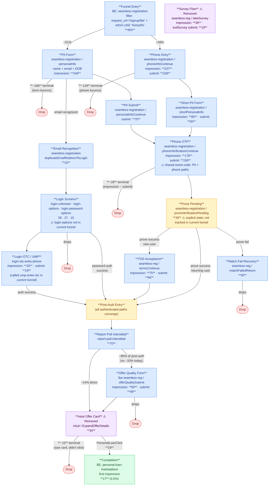

# LBE / Intuit Auth Funnel — Sep 2025

Historical snapshot of the LBE funnel from September 2025. Intuit-origin users only (filtered by `request_refUrl LIKE '%intuit%'`). Compare to `Funnels/lbe-intuit.md` for current state (Mar 2026).

**Key differences from current LBE funnel:** Near-equal PII/phone path split (51/49 vs 89/11 today), explicit Prove pending state, `intuit` branded offer card in post-auth (since removed), survey flow (`takeSurvey`/`exitSurvey`), and offer quality shown to ~86% of post-auth users (vs ~33% today). Conversion was 3.5% vs 11.8% today — a ~3.4x improvement.

## Completion Anchor

**Primary:** BigEvent `content_screen = 'personal-loan-marketplace'`, `system_eventType = 1` (first impression).

Same anchor as current LBE funnel. `personal-loan-landing` appeared as an intermediate screen for a small subset (6 cookies out of 17 completers); treat as an optional intermediate, not a required step.

## Entry Point

`seamless-registration` with `request_url = '/signup/lbe'` AND `request_refUrl LIKE '%intuit%'`

Entry filter: `content_screen = 'seamless-registration' AND request_url = '/signup/lbe' AND request_refUrl LIKE '%intuit%'`

3-day volume (Sep 1–3, 2025): **483 cookies** (~161/day; Mar 2026 is ~1,304/day — 8x growth)

## Session Stitching (Cross-Auth)

Identical to current LBE funnel: stitch via `user_cookieId` across auth boundary; use `user_traceId` within a single auth state. CookieId validated as 100% populated at entry, 0% multi-numericId cardinality (perfect 1:1) — same as current.

## Session Window

**Post-auth data extended to +3 days** from entry (Sep 1–6) to capture users who return or experience lag at account creation. Same logic as current funnel.

## User Types and Paths

### Path A: PII-First (~51% of entries, ~246 cookies)

Users land on a full PII form collecting name, email, and DOB.

- **Sub-path A1: Email Recognized** — `duplicateEmailRedirectToLogin` fires → login screens → post-auth
- **Sub-path A2: New User** — PII submit → phone OTP → Prove API (`proveVerificationPending` explicit tracking) → TOS → new account created → post-auth
- **Sub-path A3: Prove Fail** — Prove returns mismatch → `matchFailedReturn` → most drop

### Path B: Phone-First (~49% of entries, ~237 cookies)

Same structure as current LBE phone path: phone entry → OTP → short PII form → Prove/TOS. Nearly equal split with PII path in 2025 (vs 11% today).

### Post-Auth (all paths converge)

`report-pull-interstitial` → `lbe-seamless-reg` offer quality form (~86% of post-auth users, vs ~33% today) → `intuit` branded offer card → `personal-loan-marketplace` (completion)

**The `intuit` screen was removed between Sep 2025 and Mar 2026.** It was a branded Intuit offer card; users had to click `PersonalLoanClick` to proceed to the marketplace. This extra step likely contributed to lower conversion.

**Survey flow:** ~39 cookies (~8% of entrants) hit a `takeSurvey` screen; ~19 submitted `exitSurvey`. These flows have been removed.

## Step / Screen Map

| Step | Screen / Event Code | Source | Sep 1–3 Count | Notes |
|---|---|---|---|---|
| Entry | `seamless-registration` + `request_url=/signup/lbe` + `refUrl LIKE '%intuit%'` | BE | 483 cookies | |
| PII form load | `seamless-registration / personalInfo` type 3 | BE | 246 | page load — ~51% of entries |
| Phone entry impression | `seamless-registration / phoneInfoContinue` type 1 | BE | 237 | phone-first path — ~49% of entries |
| Email recognition | `seamless-registration / duplicateEmailRedirectToLogin` | BE | 10 | fires before PII submit for known CK accounts |
| PII submit | `seamless-registration / personalInfoContinue` type 2 | BE | 70 | |
| Phone submit | `seamless-registration / phoneInfoContinue` type 2 | BE | 109 | |
| Short PII form (phone-first) | `seamless-registration / shortPersonalInfo` type 3 | BE | 85 | short PII impression; submit (type 2) = 50 |
| Phone OTP impression | `seamless-registration / phoneVerificationContinue` type 1 | BE | 178 | ⚠️ shared event code; includes both PII and phone paths |
| Phone OTP submit | `seamless-registration / phoneVerificationContinue` type 2 | BE | 150 | |
| Prove pending | `seamless-registration / proveVerificationPending` type 1 | BE | 39 | explicit pending state; not tracked in current funnel |
| Match fail recovery | `seamless-registration / matchFailedReturn` type 1 | BE | 30 | Prove identity mismatch |
| TOS impression | `seamless-registration / termsContinue` type 1 | BE | 75 | |
| TOS submit | `seamless-registration / termsContinue` type 2 | BE | 66 | |
| Login screens | `login-unknown` / `login-options` / `login-password-options` / `login-unknown-step-1-dup` | BE | 28–27 each | email-recognized users; `login-options` screen not in current funnel |
| Login OTC (UMP) | `login-otc-entry-phone` | BE | 20 | UMP 2FA; called `ump-enter-otc` in current funnel |
| Survey flow | `seamless-registration / takeSurvey` type 1 | BE | 39 | removed from current funnel |
| Exit survey submit | `seamless-registration / exitSurvey` type 2 | BE | 19 | removed from current funnel |
| Report pull interstitial | `report-pull-interstitial` | BE | 70 | first post-auth screen |
| Offer quality impression | `lbe-seamless-reg / offerQualitySubmit` type 1 | BE | 60 | ~86% of post-auth users (vs ~33% today) |
| Offer quality submit | `lbe-seamless-reg / offerQualitySubmit` type 2 | BE | 48 | |
| Intuit offer card | `intuit` (ExpandOfferDetails type 1) | BE | 34 | branded offer card; removed in current funnel |
| PersonalLoanClick | `intuit / PersonalLoanClick` type 2 | BE | 19 | click from intuit screen to marketplace |
| Personal-loan-landing | `personal-loan-landing` | BE | 6 | optional intermediate screen (subset of completers only) |
| **Completion** | `personal-loan-marketplace` type 1 (first impression) | BE | **17** | |

**3-day conversion rate: 17 / 483 = 3.5%** (vs 11.8% in Mar 2026)

## Open Questions

- **Survey flow routing**: Where do `takeSurvey` users go after `exitSurvey`? Do they proceed to post-auth or drop? (39 entered, 19 submitted exit survey, and post-auth total = 70 — survey completion may feed into post-auth.)
- **`personal-loan-landing` is a marketplace modal/overlay**, not a navigation step — events on it fire at the same timestamp as `personal-loan-marketplace`. The `MarketplaceEntryClick` action on the modal leads to `personal-loan-prequal-application`. Treat as part of the marketplace experience, not a funnel step.
- **`matchFailedReturn` is non-terminal for some users**: 2 of 3 traced completers hit `matchFailedReturn` before completing. One continued within 3 min (same session, via `personal-loan-landing` modal); one returned ~1h38m later. The match fail screen may have a "continue anyway" recovery path, or users retry on a return visit. The 14 terminal drops are the hard-drop subset.
- **Phone path conversion**: Similar to current funnel — is the 49% phone-first split in 2025 driven by different traffic composition or a product decision?
- **Intuit screen impact**: 34 hit the intuit card, 19 clicked through, 17 reached marketplace. Approximately 44% drop at the intuit card (15 of 34). Removing this screen likely contributed to conversion improvement.
- **login-options vs login-unknown**: In 2025, `login-options` appears (27 cookies) — a separate screen with options like text code, email code, switch accounts. Not mapped in current funnel docs. May have been consolidated.

## Recent Metrics

Full step counts — use to calculate conversion/drop rates without requerying.

### Snapshot: Sep 1–3, 2025 (pulled 2026-03-17) — 3-day window; post-auth extended to Sep 1–6

| Step | Screen / Event | Count | Unit |
|---|---|---|---|
| Entry | seamless-reg + request_url='/signup/lbe' + refUrl LIKE '%intuit%' | 483 | cookies |
| PII form load | seamless-reg / personalInfo type 3 | 246 | cookies |
| Phone entry impression | seamless-reg / phoneInfoContinue type 1 | 237 | cookies |
| Email recognition | seamless-reg / duplicateEmailRedirectToLogin | 10 | cookies |
| PII submit | seamless-reg / personalInfoContinue type 2 | 70 | cookies |
| Phone submit | seamless-reg / phoneInfoContinue type 2 | 109 | cookies |
| Short PII impression | seamless-reg / shortPersonalInfo type 3 | 85 | cookies |
| Short PII submit | seamless-reg / shortPersonalInfoContinue type 2 | 50 | cookies |
| Phone OTP impression | seamless-reg / phoneVerificationContinue type 1 | 178 | cookies |
| Phone OTP submit | seamless-reg / phoneVerificationContinue type 2 | 150 | cookies |
| Prove pending | seamless-reg / proveVerificationPending type 1 | 39 | cookies |
| Match fail recovery | seamless-reg / matchFailedReturn type 1 | 30 | cookies |
| TOS impression | seamless-reg / termsContinue type 1 | 75 | cookies |
| TOS submit | seamless-reg / termsContinue type 2 | 66 | cookies |
| Login: email known | login-unknown-step-1-dup / clickContinue type 1 | 13 | cookies |
| Login: email unknown | login-unknown / getLoginHelp type 1 | 28 | cookies |
| Login: options screen | login-options type 3 | 27 | cookies |
| Login: password | login-password-options type 3 | 15 | cookies |
| Login: OTC (UMP) | login-otc-entry-phone type 3 | 20 | cookies |
| Login: OTC submit | login-otc-entry-phone / submitClick type 2 | 19 | cookies |
| Survey screen | seamless-reg / takeSurvey type 1 | 39 | cookies |
| Exit survey submit | seamless-reg / exitSurvey type 2 | 19 | cookies |
| Report pull interstitial | report-pull-interstitial type 1 | 70 | cookies |
| Offer quality impression | lbe-seamless-reg / offerQualitySubmit type 1 | 60 | cookies |
| Offer quality submit | lbe-seamless-reg / offerQualitySubmit type 2 | 48 | cookies |
| Intuit offer card | intuit / ExpandOfferDetails type 1 | 34 | cookies |
| PersonalLoanClick | intuit / PersonalLoanClick type 2 | 19 | cookies |
| Personal-loan-landing | personal-loan-landing | 6 | cookies |
| **Completion** | personal-loan-marketplace type 1 | **17** | cookies |

## vs. Current Funnel (Mar 2026)

| Dimension | Sep 2025 | Mar 2026 | Change |
|---|---|---|---|
| Daily entry volume | ~161/day | ~1,304/day | +8x |
| PII / phone split | ~51% / 49% | ~89% / 11% | Shifted heavily to PII |
| Post-auth offer quality rate | ~86% (60/70) | ~33% (221/667) | Reduced by ~60pp |
| Intuit offer card | Yes (34 cookies) | Removed | — |
| Survey flow | Yes (39 cookies) | Removed | — |
| Explicit Prove pending tracking | Yes (39 cookies) | Not tracked | — |
| Login path | `login-options` + `login-otc-entry-phone` | `login-unknown` variants + `ump-enter-otc` | Renamed/restructured |
| Conversion | 3.5% | 11.8% | +3.4x |

## Tables Used

- `prod-ck-abl-data-53.kafka_sponge.sponge_BigEvent` — primary event source

## Flowchart

See `Funnels/lbe-intuit-2025-flowchart.html` for the rendered diagram. Mermaid source below (keep in sync with HTML):

