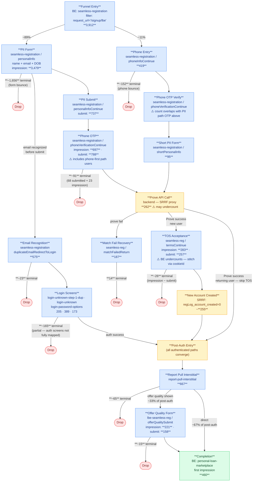

# LBE / Intuit Auth Funnel

Users arriving via Intuit's Lightbox Everywhere (LBE) program start unauthenticated. They land on a full PII registration form (name + email + DOB) or, less commonly, a phone-entry flow. After completing registration or login, they land on the Personal Loan Marketplace.

**Key difference from ChatGPT funnel:** LBE uses a PII-first entry path (majority) rather than phone-first. Completion is a product screen (`personal-loan-marketplace`), not a consent click.

## Completion Anchor

**Primary:** BigEvent `content_screen = 'personal-loan-marketplace'`, `system_eventType = 1` (first impression).

`link-anywhere` is NOT the LBE completion anchor — only 10 LBE entry-cohort users hit it over 3 days. LBE completers use implicit consent or a different consent mechanism and proceed directly to the marketplace.

## Entry Point

`seamless-registration` with `request_url = '/signup/lbe'` — consistent first screen for all LBE users.

Entry filter: `content_screen = 'seamless-registration' AND request_url = '/signup/lbe'`

3-day volume (Mar 1–3, 2026): **3,912 cookies** (all LBE origins, no refUrl filter) · Intuit-origin only (`refUrl LIKE '%intuit%'`): **~2,159** (~55% of total LBE traffic)

## Session Stitching (Cross-Auth)

Users start unauthenticated — early funnel events have NULL `user_dwNumericId`. Stitching follows the same pattern as the ChatGPT funnel:

**Session stitching definition:**
1. **Within a single auth state:** use `user_traceId`
2. **Across auth boundary or page reloads:** use `user_cookieId` — validated 0% of cookies map to multiple numericIds (perfect 1:1 cardinality, 3-day sample)
3. **Recommended query pattern:** find completers via `personal-loan-marketplace` impression → get their `cookieId` → pull all events on that cookieId within the session window

**Known stitch limitation:** cookieId changes at account creation (same as ChatGPT). TOS and post-auth events may be on a new cookieId. Extended post-auth window (Mar 1–6) compensates for this.

**Coverage:** cookieId 100% populated at entry; numericId ~37% populated at entry (expected — users are pre-auth).

## Session Window

**Estimated:** 15–30 minutes for the full funnel. **Post-auth data extended to +3 days** from entry to capture users who authenticate on a return visit or experience lag at the account-creation step.

## User Types and Paths

### Path A: PII-First (majority, ~89% of entries)

Users land on a full PII form at `/signup/lbe` collecting name, email, and date of birth.

- **Sub-path A1: Email Recognized** — `duplicateEmailRedirectToLogin` fires when email matches an existing CK account → user routed to login screens → auth → post-auth
- **Sub-path A2: New User** — user submits PII → phone OTP → Prove API → TOS → new account created → post-auth
- **Sub-path A3: Prove Fail** — Prove returns match failure → `matchFailedReturn` recovery screen → most drop
- **Sub-path A4: Returning via Prove** — Prove success for returning user → skip TOS → post-auth directly

### Path B: Phone-First (minority, ~11% of entries)

Same as ChatGPT core path: phone entry → OTP → short PII form → Prove/TOS. **Low marketplace conversion (~5%)** — these users may be completing on a different downstream screen or abandoning at higher rates.

### Post-Auth (all paths converge)

`report-pull-interstitial` → [`lbe-seamless-reg` offer quality form, ~33% of post-auth users] → `personal-loan-marketplace` (completion)

## Step / Screen Map

| Step | Screen / Event Code | Source | 3-Day Count | Notes |
|---|---|---|---|---|
| Entry | `seamless-registration` + `request_url=/signup/lbe` | BE | 3,912 cookies | |
| PII form load | `seamless-registration / personalInfo` type 3 | BE | ~3,479 | page load event |
| Email recognition | `seamless-registration / duplicateEmailRedirectToLogin` | BE | 575 | fires before PII submit when email is a known CK account |
| PII submit | `seamless-registration / personalInfoContinue` type 2 | BE | 737 | user-submitted full PII |
| DOB validation success | `seamless-registration / dobValidationSuccessAndContinue` | BE | ~755 | sub-step within PII form |
| DOB validation error | `seamless-registration / dobValidationError` | BE | ~780 | sub-step; high error rate |
| Login: email known | `login-unknown-step-1-dup / clickContinue` | BE | 205 | step 1 of login for recognized email |
| Login: email unknown | `login-unknown / getLoginHelp` | BE | 389 | ⚠️ high "get help" rate — many struggling users |
| Login: password | `login-password-options / submitClick` | BE | 173 (impression), 135 (submit) | |
| Registration | `reg-step-1 / navDestination` | BE | 156 | appears after login failure / redirect to signup |
| Phone OTP (PII path + phone-first) | `seamless-registration / phoneVerificationContinue` | BE | 697 (impression), 788 (submit) | ⚠️ shared event code for both paths |
| Prove API call | backend (SRRF gap-fill) | SRRF | ~262 | ⚠️ `prove_fail` flag unreliable in SRRF; use `matchFailedReturn` BE event to count failures |
| Match fail recovery | `seamless-registration / matchFailedReturn` | BE | 187 | Prove identity mismatch; most users drop here |
| TOS acceptance | `seamless-registration / termsContinue` | BE | 283 (impression), 257 (submit) | ⚠️ BE may undercount — cookieId changes at account creation; stitch via cookieId with extended window |
| New account created | SRRF `regLog_account_created = 0` | SRRF | ~255 | note: flag is inverted (0 = success) |
| Phone entry (phone-first path) | `seamless-registration / phoneInfoContinue` | BE | 419 | phone-first entry |
| Short PII form (phone-first) | `seamless-registration / shortPersonalInfo` | BE | 95 | ChatGPT-equivalent PII form |
| Report pull interstitial | `report-pull-interstitial` | BE | 667 | first post-auth screen |
| Offer quality form | `lbe-seamless-reg / offerQualitySubmit` | BE | 221 (impression), 158 (submit) | appears for ~33% of post-auth users |
| **Completion** | `personal-loan-marketplace` (type 1 first impression) | BE | **460** | |

**3-day conversion rate: 460 / 3,912 = ~11.8%**

## Drop-Off Summary

Terminal drops from non-completers (partial — ~1,243 drops at unmapped auth/2FA screens not counted):

| Drop Point | Terminal Cookies | Type |
|---|---|---|
| PII form bounce (didn't submit) | ~1,656 | Organic — form load with no submit action |
| Phone-first bounce (didn't submit phone) | ~152 | Organic — phone screen impression only |
| Login screens | ~165 | Mix (partial — some auth screens not mapped) |
| OTP drop (submitted OTP, nothing after) | ~91 | Disappearance |
| Email recognition terminal | ~23 | Organic |
| Report-pull interstitial | ~65 | Organic |
| Offer quality form | ~15 | Organic |
| Match fail recovery | 14 | Organic |
| **Total captured** | **~2,209** | of 3,452 total (64%) |

**Key insight:** The PII form is the dominant drop point — ~48% of all captured drops. Most users see the form but never submit it. This is structurally different from ChatGPT where phone entry (a lighter ask) is the entry step.

## Open Questions

- **Phone-first path completion**: Only 5.2% of phone-first-only users reach `personal-loan-marketplace`. Either this path converts very poorly for LBE, or completers land on a different downstream screen not yet identified.
- **Unmapped drops**: ~1,243 terminal drops not captured — likely at `force-2fa-*`, `login-mfa-setup`, or other auth/2FA screens. Run a broader last-event query to surface these.
- **`login-unknown` getLoginHelp (389)**: Very high "get help" rate from the email-recognition login path. May indicate many users don't remember their CK login. Worth investigating conversion from this screen.
- **OTP count anomaly**: `phoneVerificationContinue` submit (788) > impression (697). Event codes may be tracking slightly different things across paths. Validate separately.
- **reg-step-1 (156 cookies)**: Appears in LBE paths — likely users who fail login and are redirected to standard signup. Does this path converge back to post-auth? Not yet validated.
- **Post-auth cookieId stitch**: TOS/new-account users get a new cookieId at account creation. Extended window (Mar 1–6) compensates but may still miss some. SRRF `regLog_account_created` can gap-fill.

## Recent Metrics

Full step counts — use these to calculate any conversion/drop rate without requerying. Append a new snapshot when counts are refreshed.

### Snapshot: Mar 1–3, 2026 (pulled 2026-03-17) — 3-day window; post-auth extended to Mar 1–6

| Step | Screen / Event | Count | Unit |
|---|---|---|---|
| Entry | seamless-registration + request_url='/signup/lbe' | 3,912 | cookies |
| PII form load | seamless-reg / personalInfo type 3 | 3,479 | cookies |
| Email recognition | seamless-reg / duplicateEmailRedirectToLogin | 575 | cookies |
| Email recognition drop (terminal) | — | ~23 | cookies |
| Login: email known | login-unknown-step-1-dup / clickContinue | 205 | cookies |
| Login: email unknown | login-unknown (top event: getLoginHelp) | 389 | cookies |
| Login: password | login-password-options impression | 173 | cookies |
| Login: password submit | login-password-options / submitClick | 135 | cookies |
| Login: reg redirect | reg-step-1 / navDestination | 156 | cookies |
| Login path drop (terminal) | — | ~165 | cookies |
| PII submit | seamless-reg / personalInfoContinue type 2 | 737 | cookies |
| PII form bounce (terminal) | — | ~1,656 | cookies |
| Phone OTP impression | seamless-reg / phoneVerificationContinue type 1 | 697 | cookies |
| Phone OTP submit | seamless-reg / phoneVerificationContinue type 2 | 788 | cookies |
| OTP drop (terminal) | — | ~91 | cookies |
| Prove API call | backend (SRRF gap-fill) | ~262 | cookies |
| Match fail recovery | seamless-reg / matchFailedReturn | 187 | cookies |
| Match fail drop (terminal) | — | 14 | cookies |
| TOS impression | seamless-reg / termsContinue | 283 | cookies |
| TOS submit | seamless-reg / termsContinue type 2 | 257 | cookies |
| TOS drop (terminal) | — | ~26 | cookies |
| New account created | SRRF regLog_account_created=0 | ~255 | cookies |
| Phone-first entry (path B) | seamless-reg / phoneInfoContinue | 419 | cookies |
| Phone-first bounce (terminal) | — | ~152 | cookies |
| Short PII form | seamless-reg / shortPersonalInfo | 95 | cookies |
| Report pull interstitial | report-pull-interstitial | 667 | cookies |
| Report pull drop (terminal) | — | ~65 | cookies |
| Offer quality impression | lbe-seamless-reg / offerQualitySubmit type 1 | 221 | cookies |
| Offer quality submit | lbe-seamless-reg / offerQualitySubmit type 2 | 158 | cookies |
| Offer quality drop (terminal) | — | ~15 | cookies |
| **Completion** | personal-loan-marketplace type 1 (first impression) | **460** | cookies |

### Snapshot: Jan 1 – Mar 16, 2026 YTD (pulled 2026-03-17) — entry volume only

| Step | Count | Unit | Notes |
|---|---|---|---|
| Entry total (YTD) | ~57,800 | cookies | strong weekday pattern; ~400–800/day Jan → ~1,100–1,400/day Mar |
| Daily entry avg | ~771/day | cookies | growing; recent weeks averaging ~1,200–1,300/day |

## Tables Used

- `prod-ck-abl-data-53.kafka_sponge.sponge_BigEvent` — primary event source
- `prod-ck-abl-data-53.dw.seamless_registration_raw_funnel` (SRRF) — gap-fill for Prove and account creation

## Flowchart

See `Funnels/lbe-intuit-flowchart.html` for the rendered diagram. Mermaid source below (keep in sync with HTML):

## Cohort Analysis

### Methodology

Same framework as `chatgpt-auth.md`: first-signal classification, uniform dropout assumption, proportional drop allocation. Anchor = **Entry** (3,912 cookies, Mar 1–3 2026) — LBE has no shared intermediate step; users fork immediately at entry.

**Cat2 (🟠) first signals:** DUP_EMAIL (email recognized before PII submit) + Prove_success returning user (skip TOS). **Cat3 (🟢) first signal:** TOS impression. **Cat1 (🔵)** nearly absent in LBE.

**Drop allocation mix:** Prove-derived Cat2=33.3% / Cat3=66.7% (SRRF Prove_success=427: Cat3=285, Cat2=142). DUP_EMAIL Cat2 is already separately classified, so unclassified drops reflect the Prove-path mix.

### Cohort Population and Completion Rate

Counts from 3-day step snapshot + SRRF Prove_success query. Completions are **directly queried** — Cat2 via BE completer classification query; Cat3 via SRRF (BE undercounts Cat3 because `personal-loan-marketplace` fires post-account-creation on a new cookieId; BE query confirmed only 70 Cat3 completers vs 255 SRRF).

| Cohort | Classified | Allocated drops | % of users | Completions | Completion rate | Completion rate (from first signal) |
|---|---|---|---|---|---|---|
| 🔵 Phone match | 25 | — | **0.6%** | 3 | 12.0% | 12.0% |
| 🟠 PII/cred match | 717 | 961 | **42.9%** | 183 (BE direct) | **10.9%** | 25.5% (of 717) |
| 🟢 New user | 283 | 1,926 | **56.5%** | 255 (SRRF) | **11.5%** | 90.1% (of 283 TOS) |
| **Total** | **1,025** | **2,887** | **100%** | **~441** | **~11.3%** ≈ 11.8% ✓ | — |

**Cat2 classified:** 575 DUP_EMAIL + 142 SRRF Prove_success returning user = 717
**Cat1 back-calc:** 667 − 255 (Cat3) − 142 (Prove_Cat2) − 245 (login_success) = 25

**Validation:** 42.9% × 10.9% + 56.5% × 11.5% + 0.6% × 12% = 4.7 + 6.5 + 0.1 = **11.3% ≈ 11.8%** ✓

### Interpretation

- 🟢 New users are the dominant cohort (56.5%) — LBE Intuit is primarily a new-user acquisition channel; only 15% of users are email-recognized existing members (DUP_EMAIL)
- 🟠 Existing users convert 2× better from anchor (15.9% vs 8.0%) because they bypass the Prove/TOS registration gauntlet
- 🔵 Phone match is nearly absent (<1%) — LBE is PII-first; Prove-based phone recognition is rare
- Only 12.8% of the Cat3 cohort reaches TOS (283 / 2,209) — pre-TOS attrition is the dominant loss for new users
